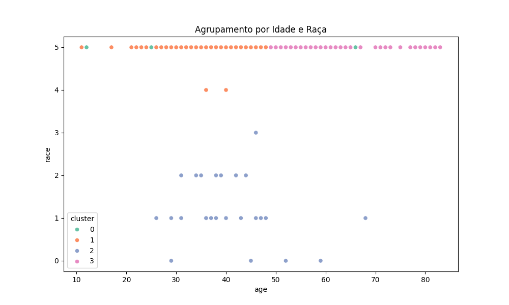
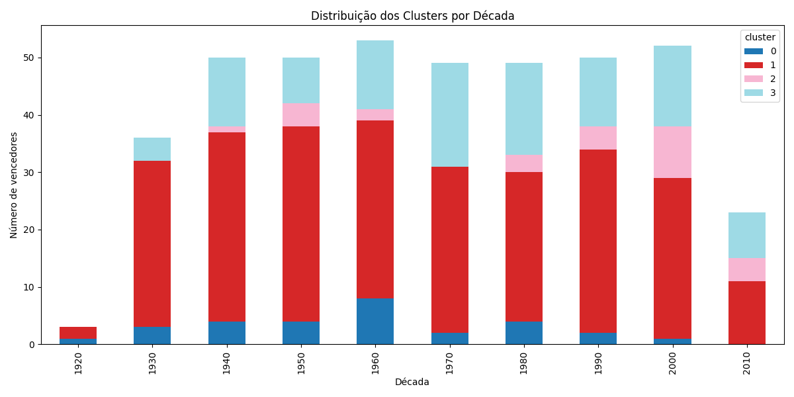

# 📊 Relatório do Projeto - Ciência de Dados

## 👥 Informações do Grupo

**Turma:** 3ºC
**Grupo:** 4
**Integrantes:** Caio, Pedro, Arthur, Cibele, Camila, Rafa

**Link do Dataset:** [Oscar](https://basedosdados.org/dataset/faf3f3ae-e5af-4ec1-9f4c-aa38f677cd71?table=59270276-dc2f-462a-a4d5-dbd22b077046)

## 📈 1. Nossos Dados

### Sobre o Dataset

- **Nome do dataset:** world_ampas_oscar_winner_demographics
- **Tamanho:** 415 linhas e 10 colunas
- **Período:** 1927 até 2014

### Principais Informações

- **Tipo de dados:** birth_year, birth_date, birthplace, race_ethnicity, religion, sexual_orientation, year_edition, category, movie

- **Região coberta:** Mundo
- **Fonte original:** Base dos Dados

## ❓ 2. Nossa Pergunta Principal

**Queremos descobrir:** Como o perfil demográfico dos indicados às premiações cinematográficas evoluiu ao longo dos anos, e quais fatores estão associados às diferentes categorias de indicação?

### Por que isso é importante?

Estudar este tema nos ajuda a:

- Estudar quem foi indicado (e quem não foi) ao longo das décadas expõe desigualdades estruturais da indústria cinematográfica.
- A análise histórica permite medir se os avanços em diversidade são reais ou apenas simbólicos.
- Ajuda a refletir como o reconhecimento artístico ainda é atravessado por estereótipos e limitações sociais.

### Nossas 5 Perguntas Específicas

1. Como o dinheiro é distribuído de forma diferente em cada região do Brasil?
2. Existe associação entre idade e categoria de premiação?
3. Quais religiões e orientações sexuais aparecem com menor frequência nas indicações?
4. A diversidade demográfica dos indicados aumentou ao longo das edições?
5. É possível prever a categoria de premiação de uma pessoa com base no seu perfil demográfico?

## 🔍 3. O Que Descobrimos

### Fatos Interessantes

1. Categorias premiadas seguem um padrão etário claro.
2. Minorias étnicas estão concentradas em um único cluster, com pouco espaço.
3. Categorias premiadas seguem um padrão etário claro.

### Nossos Gráficos

**Previsão de categoria com perfil demográfico:**


- O que mostra: Mostra, passo a passo, como o modelo toma decisões com base nas variáveis para prever a categoria de premiação.

**Kmeans idade X raça**


- O que mostra: Mostra um Gráfico de correlação entre Idade e Raça

**Kmeans por década**


- O que mostra: Mostra a quantidade de vencedores de cada cluster em cada década

### Problemas Encontrados

- Categorias como “Best Actress” e “Best Supporting Actress” têm muito menos registros do que “Best Actor” ou “Best Director”.
- Colunas como religion têm mais de 60% de valores ausentes.

## 🤖 4. Nossos Algoritmos

### Primeiro Algoritmo: Classificação com Árvore de Decisão

**O que faz:** O constrói um modelo preditivo que tenta descobrir padrões entre o perfil das pessoas (como idade, raça, religião e orientação sexual) e a categoria do Oscar que elas ganharamr
**Por que usamos:** Foi usado para responder as perguntas 2 e 5.
**Exemplo de resultado:**

```
-> Relatório de Classificação
                         precision    recall  f1-score   support

             Best Actor       0.26      0.45      0.33        11
           Best Actress       0.56      0.82      0.67        17
          Best Director       0.43      0.62      0.51        21
  Best Supporting Actor       0.38      0.17      0.23        18
Best Supporting Actress       1.00      0.06      0.12        16

               accuracy                           0.43        83
              macro avg       0.53      0.43      0.37        83
           weighted avg       0.53      0.43      0.38        83

Acurácia: 0.43

-> Importância das Variáveis
age: 0.66
race: 0.05
religion: 0.23
orientation: 0.06
```

- O modelo mostra que é possível prever parcialmente a categoria da premiação com base no perfil da pessoa (43% de acurácia).
- Algumas categorias são mais previsíveis que outras (ex: "Best Actress", "Best Director").
- A variável idade teve o maior peso na previsão: **66%** da importância. Dessa forma é possivel perceber que existe uma relação clara entre idade e categoria

### Segundo Algoritmo: Análise de Clusters (K-means)

**O que faz:** Agrupa os vencadores por características como **idade**, **raça**, **religiâo** e **orientação sexual**
**Por que usamos:** Usado parar gerar estatísticas como: perfis semelhantes entre premiados, se houve mudança nesses perfis e visualizar quais são os grupos dominantes. também foi usado para responder as perguntas 1, 3 e 4
**Exemplo de resultado:**

**Cluster 0 – “Artistas LGBTQIA+ brancos, premiados jovens”**

- Idade média: ~43 anos
- Raça: 100% branca
- Religião: Diversificada, não tão concentrada quanto nos outros
- Orientação sexual: Predominantemente bissexual, gay ou lésbica
- Categorias mais comuns: Best Director, Best Actress, Best Actor
- Tamanho: 29 pessoas (grupo pequeno)

Esse cluster reúne artistas brancos, mas com diversidade de sexualidade e mais variedade religiosa. Mesmo sendo pequeno, representa uma minoria significativa no perfil tradicional da Academia.

**Cluster 1 – “Perfil padrão da Academia”**

- Idade média: ~38 anos
- Raça: Quase todos brancos
- Religião: Muito concentrada num único código (provavelmente cristianismo ou não informado)
- Orientação sexual: Majoritariamente heterossexual (straight)
- Categorias comuns: Best Actress, Best Director, Best Supporting Actress
- Tamanho: 255 pessoas (maior cluster)

Esse é o grupo hegemônico: branco, heterossexual, religioso "mainstream" e presente em todas as categorias. Representa o perfil mais frequente de vencedores históricos do Oscar.

**Cluster 2 – “Minorias raciais com destaque em categorias coadjuvantes”**

- Idade média: ~41 anos
- Raça: Maioria negros, hispânicos e asiáticos
- Religião: Diversificada, mas também dominada pelo código 10
- Orientação sexual: Quase todos heterossexuais
- Categorias comuns: Best Supporting Actress, Best Supporting Actor, Best Actor
- Tamanho: 27 pessoas

Esse cluster agrupa minorias étnicas, que aparecem com baixa frequência no geral e com maior presença em categorias de coadjuvante. Mostra como a representatividade racial ainda é limitada e focalizada.

**Cluster 3 – “Veteranos tradicionais”**

- Idade média: ~60 anos
- Raça: 100% branca
- Religião: Predominantemente código 10 (provavelmente cristã ou não declarada)
- Orientação sexual: Heterossexual
- Categorias comuns: Best Supporting Actor, Best Actor, Best Director
- Tamanho: 104 pessoas

Esse grupo representa os mais velhos entre os vencedores, todos brancos, héteros e com um perfil mais "clássico e tradicional" da Academia. Possivelmente atores e diretores veteranos.

## 📋 5. Próximos Passos

1. Tratar melhor os dados ausentes e inconsistentes
2. Testar outros algoritmos de classificação
3. Aplicar análise de componentes principais (PCA)

## 👥 6. O Que Cada Um Fez

- **Caio:** Escreveu os scripts de Decision Tree e interpretação dos resultados
- **Pedro:** Fez a limpeza e organização dos dados do dataset
- **Arthur:** Criou todos os gráficos e visualizações (histogramas, boxplots, clusters)
- **Cibele:** Escreveu os textos explicativos, resumo da análise e conclusões
- **Camila** Aplicou o algoritmo K-Means e fez a análise dos clusters
- **Rafa** Tratou os valores ausentes, codificações e melhorou os modelos

---

**Data de Entrega:** 30/06/2025
**Link do Notebook:**

- **Kmeans:** [kmeans_oscar.ipynb](https://colab.research.google.com/drive/1z3M3odgcm9rTv0Ivmt7P6N7QRdsMcC0a?usp=sharing)
- **Decision Tree:** [Decision_tree.ipynb](https://colab.research.google.com/drive/1EJ5tDORvC5tPC9SSprMqp03KZUoYCg5o?usp=sharing)
